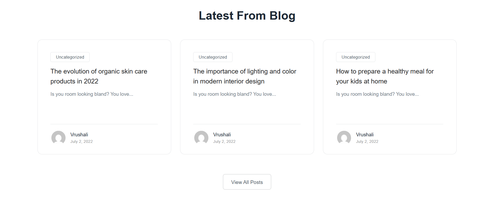
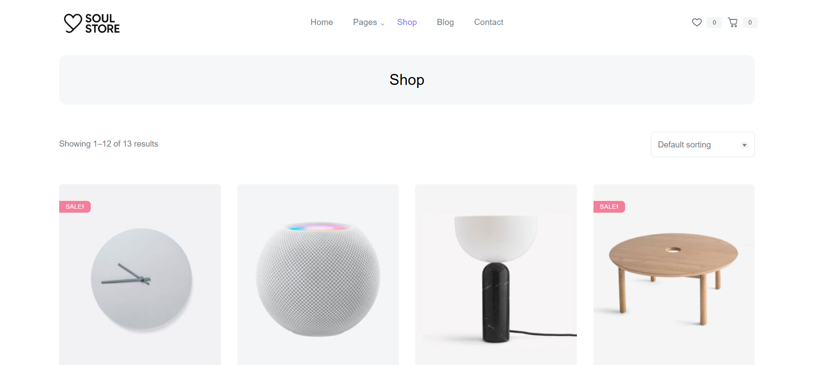
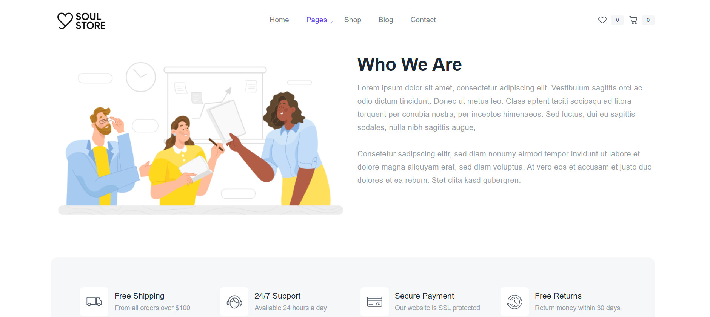

# 🛍️ Soul Store - Ecommerce Website using WordPress

Welcome to **Soul Store**, a modern and stylish ecommerce platform developed using **WordPress**. This project showcases a fully functional online store with integrated product pages, shopping cart, checkout functionality, and a user-friendly admin dashboard.

---
## 🚀 Features

- ✅ Custom WordPress theme
- ✅ WooCommerce integration
- ✅ Responsive design for all devices
- ✅ Shopping cart and checkout
- ✅ Payment gateway ready
---

## 🛠️ Technologies Used

- WordPress CMS
- WooCommerce Plugin
- HTML, CSS, PHP
- MySQL (via XAMPP or Live Host)
- Custom theme development

---

## 🧩 Installation & Setup

### 🔧 Requirements:
- XAMPP / Localhost setup OR Live hosting
- WordPress Installed
- Git (optional)

## 📸 Project Screenshots

-HomePage: 

-Blog: 
-Shop:  
-About: 

### 🗂️ Steps:

1. Clone the repository:
  https://github.com/vrushali29-git/Ecommerce-site-using-wordpress.git
